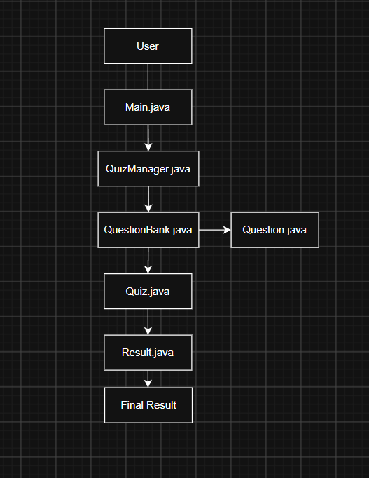

# System Architecture

The Java Quiz Application follows a simple modular architecture.

## Architecture Diagram

## Description
    -> Main.java handles the main menu and user choices.
    -> QuizManager.java creates and manages the quiz.
    -> QuestionBank.java stores the quiz questions.
    -> Question.java represents an individual question and its options.
    -> Quiz.java displays questions and checks the user's answers.
    -> Result.java calculates the percentage and displays the final grade.